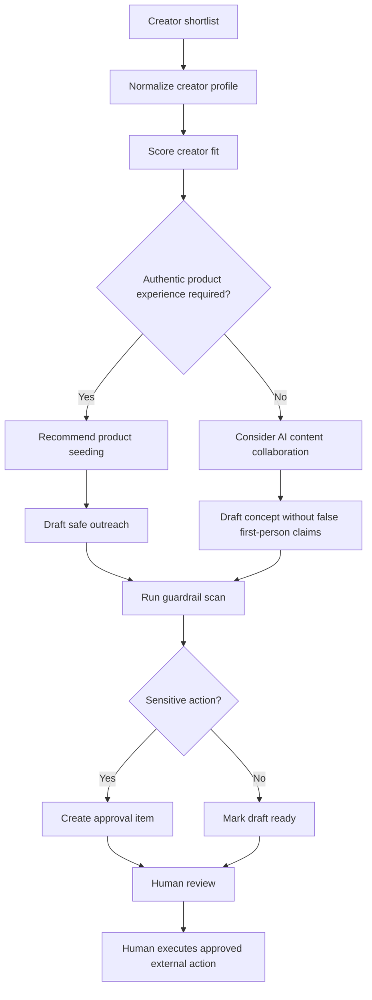

# Mako Creators Agent Workflow

## Operating Principle

Mako prepares creator operations work and routes sensitive actions to humans. It does not complete irreversible external actions.

## Workflow

## Current Implementation Surface

The MVP cockpit now reads from a shared overview layer:

- Page: `/ops`
- API: `GET /api/ops/overview`
- Server helper: `getOpsOverview(workspaceId)`

The helper returns preview data in local no-database mode and uses existing workspace counts when a database is configured. This is intentionally not an external automation surface yet; it prepares and displays work, but does not execute external actions.

## Steps

### 1. Intake

Inputs:

- Campaign goal.
- Business or product context.
- Target audience.
- Creator shortlist.
- Brand voice.
- Restricted claims.

Outputs:

- Normalized creator records.
- Missing-data warnings.

### 2. Creator Scoring

Mako evaluates:

- Audience fit.
- Content quality.
- Brand safety.
- Product relevance.
- Engagement signal.
- Authenticity need.

### 3. Collaboration Path Selection

Mako recommends:

- Product seeding when authentic experience is required.
- AI content collaboration when the output can be a script, hook, or video draft without claiming the creator used the product.
- Hold when data is incomplete or risk is unclear.
- Reject when fit or safety is poor.

### 4. Drafting

Allowed:

- Internal outreach drafts.
- Briefs.
- Script concepts.
- Product talking points.
- Follow-up suggestions.

Blocked:

- Payment promises.
- Usage-rights commitments.
- False first-person product-use claims.
- External sending.

When an outreach draft is created through `POST /api/outreach-drafts`, Mako also creates a linked `SEND_OUTREACH` approval item. This makes every external-message candidate visible in the internal approval queue before any human action happens outside the MVP.

### 5. Guardrail Scan

Hard-blocked actions:

- Promise payment.
- Approve paid collaboration.
- Ship samples.
- Agree to usage rights.
- Sign contracts.
- Send external messages.
- Publish content.
- Launch paid ads.

### 6. Approval Routing

Mako creates an internal `Approval` item for any sensitive next step. The item can be listed through `GET /api/approvals`, created through `POST /api/approvals`, and reviewed through `PATCH /api/approvals/:id`.

Approval examples:

- Send this outreach draft.
- Ship a sample.
- Discuss paid collaboration.
- Request usage rights.
- Approve AI content script.

Approval status options:

- `PENDING`
- `APPROVED`
- `REJECTED`
- `NEEDS_CHANGES`
- `ARCHIVED`

Approval records can reference a campaign, creator, or outreach draft, but they remain internal workflow records.

### 7. Human Execution

After approval, the user performs the external action outside the MVP. Mako records the state as externally completed by a human.

## Day Mode and Night Mode

Day mode:

- Ask before major product direction changes, schema changes, legal/business commitments, external integrations, or irreversible actions.

Night mode:

- Continue autonomously within safe boundaries.
- Prefer reversible local changes.
- Do not perform external actions.
- Leave clear notes for review.
